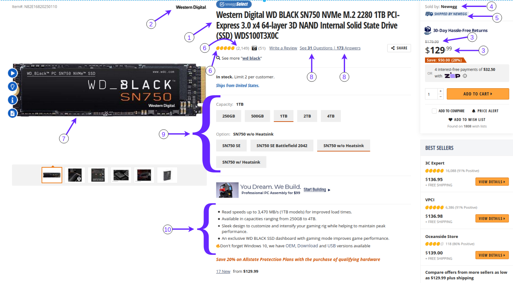

# The Crawler Project


<p align="center">
  
</p>


## Project Goal
This project is designed to show your skills on Python, Django, OOP design principles and scraping.

The point of this project is to become more familiar with the **principles of software design** and **scraping**. So make sure that your code follows the software design principles "**I care a lot about clean code**".


## Project Description
What we want from you in this project is to extract the content of Newegg.com products. We want you to do this project as a REST API with the Django framework. so we have an API that extracts the content we want from the product page by calling that API.


## Implementation
- Use Virtualenv to handle your dependencies
- Use `Black (Python code formatter)` third-part package to clean your code on PEP 8 style
- Use Django framework to implement REST API
- Use MySQL database to persist product data
- Use Django admin for the product model
- Write a short README file to describe how did you do on this project

  





## Image Description
- 1 - Title
- 2 - Brand Name
- 3 - Price and Discount
Example:
```json
{
    "price": {
        "main": 179.99, 
        "deal": 129.99
    }
}
```
- 4 - Sold by
- 5 - Shipped by
- 6 - Rates
Example:
```json
{
    "rates": {
        "stars": 5, 
        "count": 2149
    }
}
```
- 7 - Image: Use `src` attribute from  tag to get full image URL.
Example:
```
{
    "image": "https://c1.neweggimages.com/ProductImage/20-250-110-07.jpg"
}
```
- 8 - Questions and Answers
Example:
```json
{
    "qa": {
        "questions": 31, "answers": 173
    }
}
```
- 9 - Properties
Example:
```json
{
    "properties": {
        "capacity": [
            {
                "title": "250GB",
                "active": false
            },
            {
                "title": "1TB",
                "active": true
            }
        ],
        "option": [
            {
                "title": "SN750 SE",
                "active": false
            },
            {
                "title": "SN750 w/o Heatsink",
                "active": true
            }
        ]
    }
}
```
- 10 - Features
Example:
```
{
    "features": [
        "Read speeds up to 3,470 MB/s (1TB models) for improved load times."
        "Available in capacities ranging from 250GB to 4TB."
        "Sleek design to customize and intensify your gaming rig while helping to maintain peak performance."
        "An exclusive WD BLACK SSD dashboard with gaming mode improves game performance."
        "Read speeds up to 3,470 MB/s (1TB models) for improved load times."
    ]
}
```


## Submission
Create a **private GitHub repository** and Grant access to your mentor's account.

**Feel free to ask any question**

**Good luck :v:**
